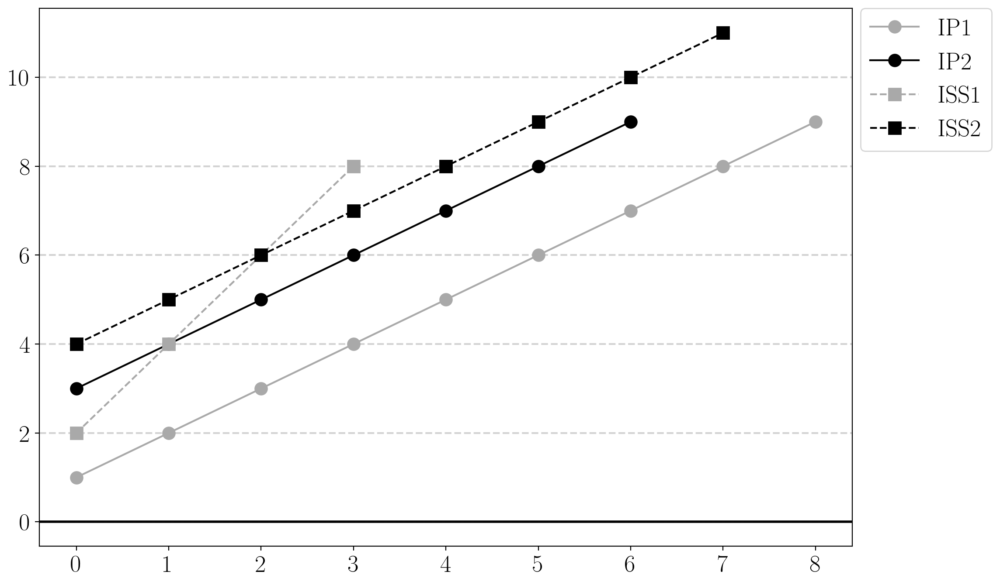
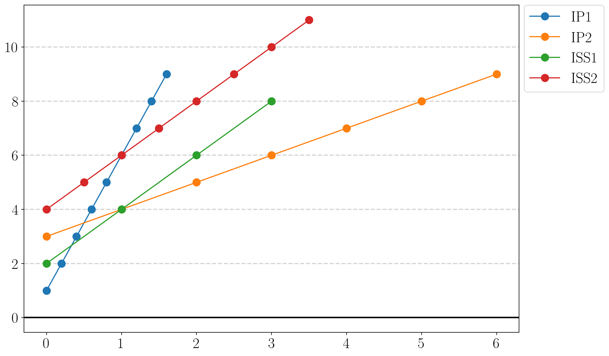
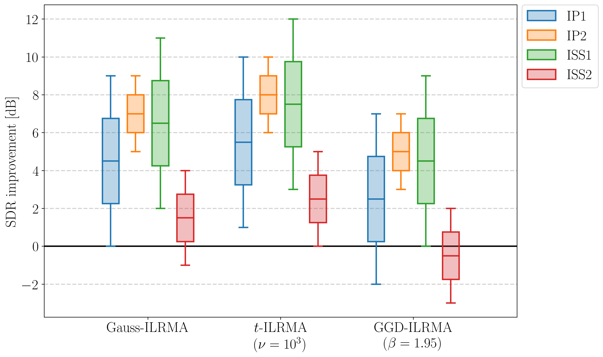

# bss-visualize
A visualization toolkit for blind source separation.

## Examples
### Plot
```python
import matplotlib.pyplot as plt
import numpy as np

from bss_visualize import plot_by_elapsed_time, plot_by_iteration, set_tex_style

params = {
    "figure.dpi": 100,
    "font.size": 20,
}
plt.rcParams.update(params)

set_tex_style()

data = {
    "IP1": np.arange(1, 10),
    "IP2": np.arange(3, 10),
    "ISS1": np.arange(2, 10, 2),
    "ISS2": np.arange(4, 12),
}
elapsed_time = {
    "IP1": np.arange(9) / 5,
    "IP2": np.arange(7),
    "ISS1": np.arange(4),
    "ISS2": np.arange(8) / 2,
}
labels = ["IP1", "IP2", "ISS1", "ISS2"]

# plot by iteration
fig, ax = plt.subplots(figsize=(12, 8))

handles = plot_by_iteration(
    ax,
    data,
    labels=labels,
    linestyle=["-", "-", "--", "--"],
    marker=["o", "o", "s", "s"],
    palette=["darkgray", "black", "darkgray", "black"],
)

ax.legend(handles, labels, bbox_to_anchor=(1.01, 1), loc="upper left", borderaxespad=0)

fig.savefig("SDRi-curve_by_iteration.pdf", bbox_inches="tight")
fig.savefig("SDRi-curve_by_iteration.png", bbox_inches="tight")

# plot by elapsed time
fig, ax = plt.subplots(figsize=(12, 8))

handles = plot_by_elapsed_time(ax, data, elapsed_time, labels=labels)

ax.legend(handles, labels, bbox_to_anchor=(1.01, 1), loc="upper left", borderaxespad=0)

fig.savefig("SDRi-curve_by_elapsed-time.pdf", bbox_inches="tight")
fig.savefig("SDRi-curve_by_elapsed-time.png", bbox_inches="tight")
```





### Group Boxplots
```python
import matplotlib.pyplot as plt
import numpy as np

from bss_visualize import set_tex_style, boxplot_by_group

params = {
    "figure.dpi": 100,
    "font.size": 20,
}
plt.rcParams.update(params)

set_tex_style()

sdri = {
    "Gauss-ILRMA": {
        "IP1": np.arange(0, 10),
        "IP2": np.arange(5, 10),
        "ISS1": np.arange(2, 12),
        "ISS2": np.arange(-1, 5),
    },
    r"$t$-ILRMA"
    + "\n"
    + r"($\nu=10^{3}$)": {
        "IP1": np.arange(1, 11),
        "IP2": np.arange(6, 11),
        "ISS1": np.arange(3, 13),
        "ISS2": np.arange(0, 6),
    },
    "GGD-ILRMA"
    + "\n"
    + r"($\beta=1.95$)": {
        "IP1": np.arange(-2, 8),
        "IP2": np.arange(3, 8),
        "ISS1": np.arange(0, 10),
        "ISS2": np.arange(-3, 3),
    },
}
labels = [
    "Gauss-ILRMA",
    r"$t$-ILRMA" + "\n" + r"($\nu=10^{3}$)",
    "GGD-ILRMA" + "\n" + r"($\beta=1.95$)",
]
names = ["IP1", "IP2", "ISS1", "ISS2"]

fig, ax = plt.subplots(figsize=(12, 8))

handles = boxplot_by_group(ax, sdri, labels=labels, names=names)

ax.legend(handles, names, bbox_to_anchor=(1.01, 1), loc="upper left", borderaxespad=0)
ax.set_ylabel("SDR improvement [dB]")

fig.savefig("SDRi.pdf", bbox_inches="tight")
fig.savefig("SDRi.png", bbox_inches="tight")
```


